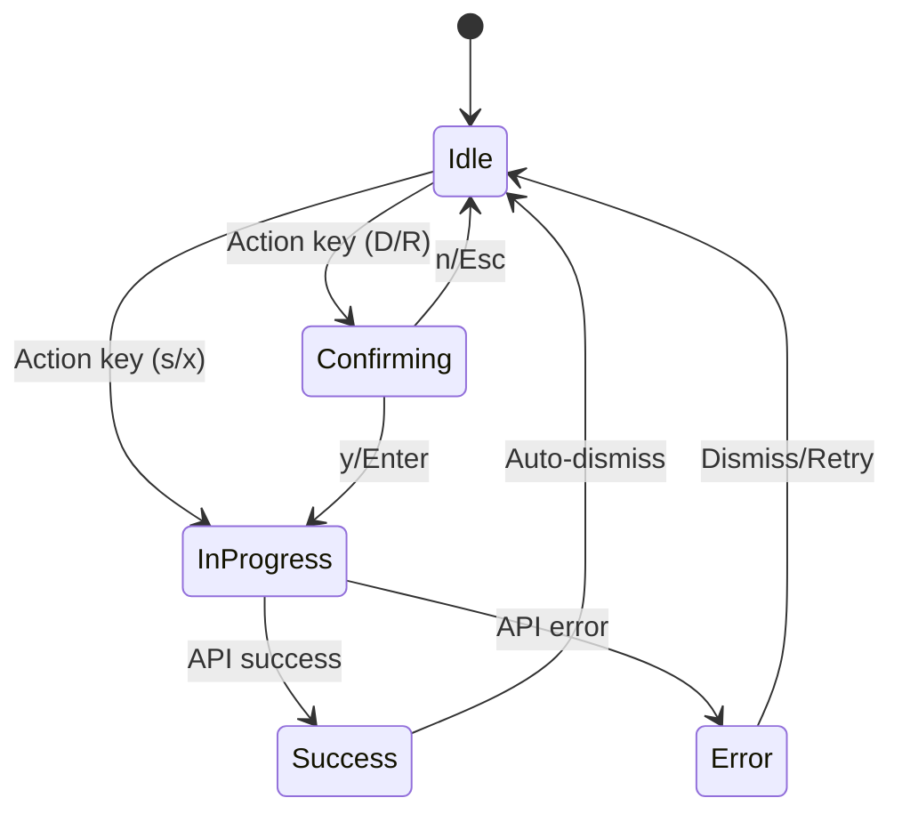
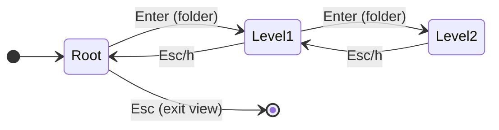
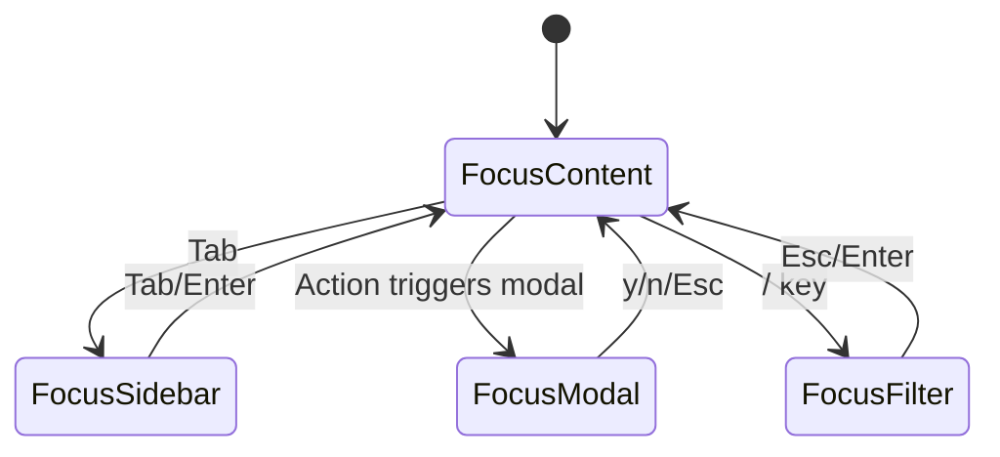
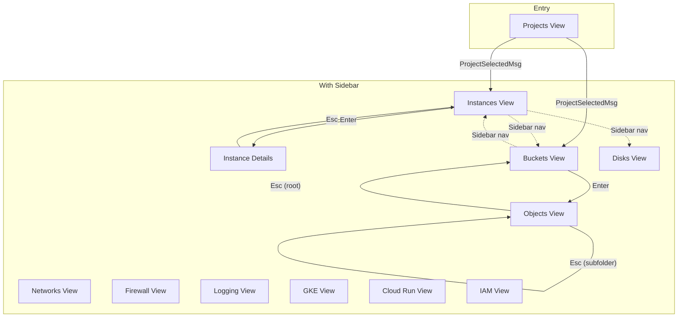
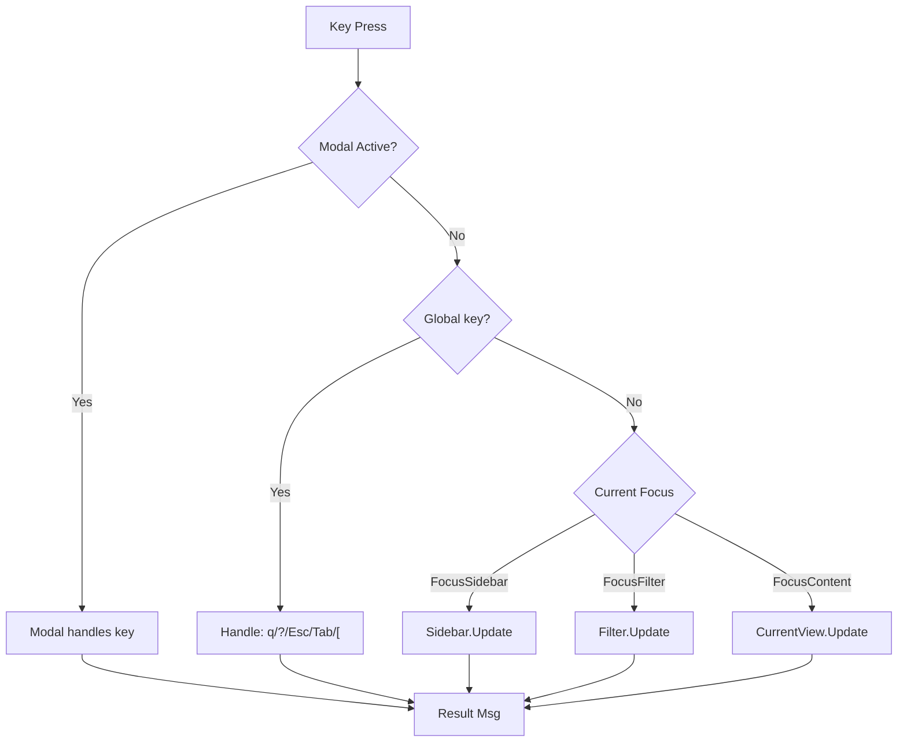

# Navigation Patterns & Design Requirements for gcon

## Objective
Design a comprehensive, consistent navigation and hotkey framework for current and future views.

---

## 1. Key Binding Taxonomy

### 1.1 Reserved Global Keys (Never Override)

| Key | Action | Rationale |
|-----|--------|-----------|
| `q` / `Ctrl+C` | Quit application | Universal exit |
| `?` | Toggle help overlay | Discoverability |
| `Esc` | Context-dependent back | Primary escape action |
| `Tab` / `Shift+Tab` | Cycle focus panels | Focus management |
| `[` | Toggle sidebar | Layout control |

### 1.2 Reserved Navigation Keys

| Key | Action | Notes |
|-----|--------|-------|
| `j` / `↓` | Move down in list | Vim-style |
| `k` / `↑` | Move up in list | Vim-style |
| `h` / `←` | Go back / collapse | Vim-style navigation |
| `l` / `→` | Go forward / expand | Vim-style navigation |
| `Enter` | Select / confirm / drill-down | Primary action |
| `g` `g` | Jump to top | Vim-style (future) |
| `G` | Jump to bottom | Vim-style (future) |
| `Ctrl+u` / `Ctrl+d` | Page up / Page down | Vim-style scrolling |

### 1.3 Reserved Operation Keys

| Key | Action | Views |
|-----|--------|-------|
| `r` | Refresh current view | All views |
| `/` | Start search/filter | List views |
| `n` | Next page / Next result | Paginated views |
| `p` | Previous page | Paginated views |
| `1-9` | Quick-select numbered item | Sidebar, numbered lists |

### 1.4 View-Specific Action Keys (Conventions)

| Key | Recommended Action | Category |
|-----|-------------------|----------|
| `s` | Start | State change |
| `x` | Stop | State change |
| `R` | Reset/Restart | Destructive (capital) |
| `d` | Download | Data transfer |
| `u` | Upload | Data transfer |
| `D` | Delete | Destructive (capital) |
| `c` | Create / Copy | Creation |
| `e` | Edit | Modification |
| `v` | View details | Information |
| `S` | SSH connect | Connection |
| `l` | View logs | Information |
| `i` | Info/Inspect | Information |
| `a` | Attach | Association |
| `A` | Detach | Disassociation (capital) |
| `t` | Toggle | State toggle |

### 1.5 Case Sensitivity Convention

- **Lowercase**: Safe, reversible operations (`s` start, `d` download)
- **Uppercase**: Destructive or confirmation-required (`D` delete, `R` reset)

---

## 2. Navigation Patterns by View Type

### 2.1 Simple List Views (Projects, Buckets)

```
State: Loading -> List -> Empty
Keys: j/k scroll, Enter select, / filter, r refresh
```

### 2.2 List with Actions Views (Instances, Cloud Run)

```
State: Loading -> List -> ActionInProgress -> List
Keys: j/k scroll, Enter details, s/x/R/D actions
```

### 2.3 Hierarchical Views (Objects, GKE pods)

```
State: Loading -> List -> (Enter folder) -> Loading -> List -> ...
Keys: Enter drills down, Esc/Backspace/h goes up
```

### 2.4 Detail/Info Views (Instance Details)

```
State: Loading -> Content (scrollable)
Keys: j/k scroll, Ctrl+u/d page scroll, action keys apply to item
```

### 2.5 Filter/Query Views (Logging)

```
State: QueryBuilder -> Loading -> Results -> (refine) -> Results
Keys: Tab between fields, Enter execute, / focus query
```

---

## 3. State Machine Diagrams

### 3.1 Action State Machine (List with Actions)



### 3.2 Hierarchical Navigation Stack



### 3.3 Focus State Transitions



### 3.4 View Hierarchy



### 3.5 Key Event Routing



---

## 4. Focus Management

### 4.1 Focus States

| State | Description |
|-------|-------------|
| `FocusContent` | Main content area has focus |
| `FocusSidebar` | Sidebar has focus |
| `FocusModal` | Modal dialog active (captures all keys) |
| `FocusFilter` | Filter/search input active (text mode) |

### 4.2 Visual Indicators

| Panel | Focused | Unfocused |
|-------|---------|-----------|
| Sidebar | Bright border, cursor visible | Dim border |
| Content | Normal colors | Slightly dimmed |
| Modal | Bright border, button highlight | N/A |

---

## 5. Modal Interaction Patterns

### 5.1 Confirmation Dialog

| Key | Action |
|-----|--------|
| `y` | Immediate confirm |
| `n` / `Esc` / `q` | Immediate cancel |
| `h` / `←` | Focus Yes |
| `l` / `→` | Focus No |
| `Tab` | Toggle focus |
| `Enter` | Confirm focused button |

### 5.2 File Picker

| Key | Action |
|-----|--------|
| `j/k` | Navigate files |
| `Space` | Toggle selection (multi-select) |
| `Enter` (dir) | Navigate into |
| `Enter` (file) | Confirm selection |
| `Backspace` / `h` | Go up directory |
| `a` | Select all |
| `Esc` | Cancel |

### 5.3 Input Dialog (Future)

| Key | Action |
|-----|--------|
| Text input | Normal typing |
| `Enter` | Confirm input |
| `Esc` | Cancel |
| `Tab` | Next field (multi-field) |

---

## 6. Help System Design

### 6.1 Contextual Footer Hints

Format: `[context-specific] • ? help • q quit`

Examples:
- Projects: `enter select • / filter • ? help • q quit`
- Instances: `s start • x stop • enter details • ? help`
- Objects: `d download • u upload • D delete • enter open`

### 6.2 Full Help Modal (`?` key)

```
+--------------------------------------------------+
|  gcon Keyboard Shortcuts                         |
+--------------------------------------------------+
| Navigation                                       |
|   ↑/k, ↓/j    Move up/down                      |
|   Enter       Select/Open                        |
|   Esc         Go back                            |
|   Tab         Switch panel focus                 |
|                                                  |
| View Actions: [View-specific section]            |
|   s           Start instance                     |
|   x           Stop instance                      |
|                                                  |
| Global                                           |
|   r           Refresh                            |
|   /           Search/Filter                      |
|   ?           Show/hide help                     |
|   q           Quit                               |
+--------------------------------------------------+
```

### 6.3 HelpProvider Interface

```go
type HelpProvider interface {
    ContextHelp() []key.Binding  // For footer (5-6 keys)
    FullHelp() [][]key.Binding   // For modal, grouped
}
```

---

## 7. Recommendations for Future Views

### 7.1 Cloud Logging

**Type:** Filter/Query View

| Key | Action |
|-----|--------|
| `/` | Focus query input |
| `Enter` | Execute query / View entry |
| `n/p` | Navigate pages |
| `f` | Add filter |
| `c` | Clear filters |
| `d` | Download logs |
| `s` | Change severity filter |

### 7.2 GKE Clusters

**Type:** Hierarchical View (Cluster -> Namespace -> Pod)

| Key | Action |
|-----|--------|
| `Enter` | Drill into cluster/namespace/pod |
| `Esc` | Go up level |
| `l` | View pod logs |
| `S` | Shell into pod |
| `d` | Describe resource |
| `D` | Delete resource |
| `s` | Scale deployment |

### 7.3 Cloud Run Services

**Type:** List with Actions

| Key | Action |
|-----|--------|
| `Enter` | View service details |
| `s` | Start traffic |
| `x` | Stop traffic |
| `D` | Delete service |
| `u` | Deploy new revision |
| `l` | View logs |

### 7.4 IAM

**Type:** List with Actions

| Key | Action |
|-----|--------|
| `Enter` | View role details |
| `c` | Create binding |
| `D` | Remove binding |
| `e` | Edit binding |

### 7.5 Disks

**Type:** Simple List with Actions

| Key | Action |
|-----|--------|
| `Enter` | View disk details |
| `c` | Create disk |
| `D` | Delete disk |
| `a` | Attach to instance |
| `A` | Detach from instance |
| `s` | Create snapshot |

### 7.6 Networks / Firewall

**Type:** List with Actions

| Key | Action |
|-----|--------|
| `Enter` | View details |
| `c` | Create rule/network |
| `D` | Delete |
| `e` | Edit rule |
| `t` | Toggle enabled (firewall) |

---

## 8. Implementation Architecture

### 8.1 Key Binding Registry

```go
// internal/ui/keybindings/registry.go

type KeyCategory string

const (
    CategoryGlobal     KeyCategory = "global"
    CategoryNavigation KeyCategory = "navigation"
    CategoryAction     KeyCategory = "action"
    CategoryModal      KeyCategory = "modal"
)

type KeyBinding struct {
    Keys        []string
    Help        string
    Category    KeyCategory
    ViewScoped  bool
}

type Registry struct {
    global     map[string]KeyBinding
    viewKeys   map[ViewType]map[string]KeyBinding
}
```

### 8.2 View Interface Extension

```go
type View interface {
    Init() tea.Cmd
    Update(tea.Msg) tea.Cmd
    View() string
    SetSize(width, height int)

    // Help system
    ContextHelp() []key.Binding
    FullHelp() [][]key.Binding
    ViewType() ViewType
}
```

### 8.3 Focus Manager

```go
type FocusManager struct {
    current     FocusState
    history     []FocusState
    activeModal Modal
}

func (fm *FocusManager) Push(state FocusState)
func (fm *FocusManager) Pop() FocusState
func (fm *FocusManager) Current() FocusState
func (fm *FocusManager) IsModalActive() bool
```

### 8.4 Key Handling Flow

```go
func (a *App) Update(msg tea.Msg) (tea.Model, tea.Cmd) {
    switch msg := msg.(type) {
    case tea.KeyMsg:
        // 1. Modal capture (highest priority)
        if a.focus.IsModalActive() {
            return a.handleModalKey(msg)
        }

        // 2. Global keys (always active)
        if cmd := a.handleGlobalKey(msg); cmd != nil {
            return a, cmd
        }

        // 3. Focus-specific routing
        switch a.focus.Current() {
        case FocusSidebar:
            return a.handleSidebarKey(msg)
        case FocusFilter:
            return a.handleFilterKey(msg)
        case FocusContent:
            return a.handleContentKey(msg)
        }
    }
}
```

---

## 9. Implementation Timeline

### Phase 1: Foundation (Keybindings Package)

**Goal:** Centralize key definitions without breaking existing functionality.

| Task | Files | Description |
|------|-------|-------------|
| 1.1 | `internal/ui/keybindings/registry.go` | Create KeyBinding struct, Registry type |
| 1.2 | `internal/ui/keybindings/global.go` | Define global keys (q, ?, Esc, Tab, [) |
| 1.3 | `internal/ui/keybindings/navigation.go` | Define navigation keys (j/k, h/l, Enter) |
| 1.4 | `internal/ui/keybindings/actions.go` | Define action key conventions |
| 1.5 | `internal/ui/keys.go` | Refactor to use registry, maintain compat |
| 1.6 | Tests | Unit tests for registry lookup |

### Phase 2: Focus Manager

**Goal:** Formal focus state management.

| Task | Files | Description |
|------|-------|-------------|
| 2.1 | `internal/ui/focus/state.go` | Define FocusState enum |
| 2.2 | `internal/ui/focus/manager.go` | Implement FocusManager |
| 2.3 | `internal/ui/app.go` | Integrate FocusManager, replace `focusedPanel` |
| 2.4 | `internal/ui/views/*.go` | Update views to work with new focus system |
| 2.5 | Tests | Focus transition tests |

### Phase 3: Help System

**Goal:** Unified, contextual help.

| Task | Files | Description |
|------|-------|-------------|
| 3.1 | `internal/ui/help/provider.go` | Define HelpProvider interface |
| 3.2 | `internal/ui/help/modal.go` | Create full help modal component |
| 3.3 | `internal/ui/help/footer.go` | Create contextual footer renderer |
| 3.4 | `internal/ui/views/projects.go` | Add ContextHelp/FullHelp methods |
| 3.5 | `internal/ui/views/instances.go` | Add ContextHelp/FullHelp methods |
| 3.6 | `internal/ui/views/buckets.go` | Add ContextHelp/FullHelp methods |
| 3.7 | `internal/ui/views/objects.go` | Add ContextHelp/FullHelp methods |
| 3.8 | `internal/ui/views/instance_details.go` | Add ContextHelp/FullHelp methods |
| 3.9 | `internal/ui/app.go` | Render dynamic footer, wire up ? key |
| 3.10 | Tests | Help rendering tests |

### Phase 4: Modal Standardization

**Goal:** Consistent modal behavior.

| Task | Files | Description |
|------|-------|-------------|
| 4.1 | `internal/ui/components/modal/modal.go` | Base modal interface |
| 4.2 | `internal/ui/components/confirm/confirm.go` | Update to implement modal interface |
| 4.3 | `internal/ui/components/filepicker/filepicker.go` | Update key handling for consistency |
| 4.4 | `internal/ui/app.go` | Add modal key capture routing |
| 4.5 | Tests | Modal key capture tests |

### Phase 5: Visual Focus Indicators

**Goal:** Clear visual feedback.

| Task | Files | Description |
|------|-------|-------------|
| 5.1 | `internal/ui/styles.go` | Add focused/unfocused style variants |
| 5.2 | `internal/ui/components/sidebar/sidebar.go` | Apply focus styles |
| 5.3 | `internal/ui/views/*.go` | Apply focus styles to content |
| 5.4 | Tests | Visual regression tests (height matching) |

### Phase 6: Documentation

**Goal:** Document patterns for future development.

| Task | Files | Description |
|------|-------|-------------|
| 6.1 | `doc/navigation.md` | Copy this design doc |
| 6.2 | `CLAUDE.md` | Update with new patterns reference |
| 6.3 | `internal/ui/README.md` | Developer guide for adding views |

---

## 10. Current Gaps to Address

| Gap | Current State | Recommendation |
|-----|--------------|----------------|
| Key duplication | Each view has its own `keyMap` | Centralize in registry |
| Help inconsistency | Help rendered differently per view | Use HelpProvider interface |
| Focus tracking | Boolean-like field | Formal FocusState enum |
| Modal capture | Partial | Unified modal key handling |
| Back behavior | 3 different patterns | Unified via HandleBack() |

---

## 11. Critical Files

- `internal/ui/keys.go` - Expand into keybindings package
- `internal/ui/app.go` - Add focus manager, unified key routing
- `internal/ui/views/instances.go` - Reference "List with Actions"
- `internal/ui/views/objects.go` - Reference "Hierarchical View"
- `internal/ui/components/confirm/confirm.go` - Modal pattern template
