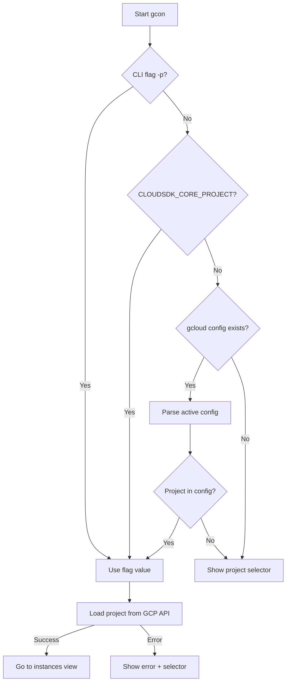

# Default GCP Project Support

## Summary

Added automatic detection and usage of the default GCP project with configurable priority.

## Changes Made

### New Files

- `internal/config/gcloud.go` - gcloud configuration file parser
- `internal/config/resolver.go` - project resolution logic with priority handling
- `internal/config/gcloud_test.go` - tests for config parsing
- `internal/config/resolver_test.go` - tests for project resolution

### Modified Files

- `cmd/gcon/main.go` - added CLI flag parsing (`-p`/`--project`)
- `internal/ui/app.go` - added `AppOptions` struct and initial project loading
- `internal/ui/messages.go` - added `InitialProjectLoadedMsg` and `InitialProjectErrorMsg`

## Usage

### CLI Flag (Highest Priority)

```bash
gcon -p my-project-id
gcon --project my-project-id
```

### Environment Variable

```bash
export CLOUDSDK_CORE_PROJECT=my-project-id
gcon
```

### gcloud Config (Automatic)

If gcloud CLI is configured, gcon automatically reads the active configuration:

```bash
# gcon will use the project from active gcloud config
gcon
```

### Fallback

If no project is configured via any method, the project selector dialog is shown (original behavior).

## Priority Order

```
1. CLI flag (-p / --project)
2. CLOUDSDK_CORE_PROJECT environment variable
3. gcloud active configuration file
4. Project selector dialog
```

## Technical Details

### gcloud Config File Locations

| File | Purpose |
|------|---------|
| `~/.config/gcloud/properties` | Contains `[core]\nconfig = <name>` to indicate active config |
| `~/.config/gcloud/configurations/config_<name>` | Configuration files with project settings |
| `CLOUDSDK_CONFIG` env var | Overrides default config directory |

### Error Handling

If the specified project fails to load (doesn't exist, no access, etc.):
1. Error message is displayed
2. Falls back to project selector dialog
3. User can select a different project

## Architecture



## Testing

Run tests with:

```bash
go test ./internal/config/... -v
```

Test coverage includes:
- INI file parsing (valid, empty, with comments)
- Config directory resolution (default, custom via env)
- Project resolution priority (flag > env > config > empty)
- Error cases (missing files, malformed config)
