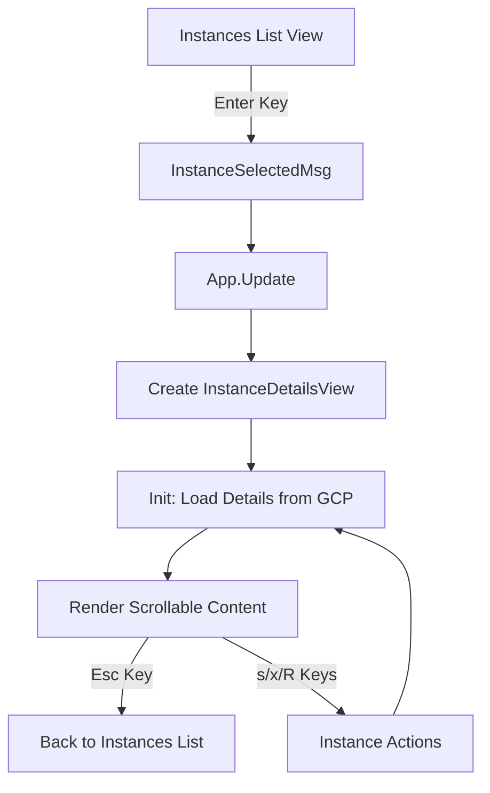

# VM Instance Details View - Documentation

## Summary of Changes

This feature adds a detailed view for VM instances, accessible by pressing Enter on any instance in the instances list. The details view displays comprehensive instance information similar to Google Cloud Console.

## Features Added

### User Interface
- **Instance Details View**: A scrollable viewport showing all instance properties
- **Navigation**: Press Enter on an instance to view details, Esc to go back
- **Instance Actions**: Start/Stop/Reset actions available directly from details view
- **Breadcrumb Navigation**: Shows current path (Project > Compute Engine > Instance Name)

### Information Displayed

The details view shows the following sections:

1. **Basic Information**
   - Name, Instance ID, Description
   - Status (with color indicator)
   - Zone, Creation timestamp
   - Deletion protection status
   - Labels and Tags

2. **Machine Configuration**
   - Machine type
   - CPU platform
   - Minimum CPU platform
   - Display device status
   - GPU accelerators

3. **Networking**
   - IP forwarding status
   - Network interfaces table (Name, Network, Subnetwork, NIC Type, IPs)

4. **Storage**
   - Attached disks table (Name, Size, Type, Mode, Boot status)

5. **Security & Access**
   - Shielded VM settings (Secure Boot, vTPM, Integrity Monitoring)
   - Service account and scopes

6. **Availability Policies**
   - Provisioning model
   - Preemptibility status
   - On-host maintenance behavior
   - Automatic restart setting

7. **Custom Metadata** (if present)

## Technical Details

### New Files
- `internal/ui/views/instance_details.go` - The details view implementation
- `internal/ui/views/instance_details_test.go` - Unit tests for helper functions
- `internal/gcp/compute_test.go` - Unit tests for GCP data transformation

### Modified Files
- `internal/gcp/compute.go` - Added `InstanceDetails` struct and `GetInstanceDetails()` method
- `internal/ui/views/instances.go` - Added Enter key handler and `GetComputeClient()` method
- `internal/ui/app.go` - Added `ViewInstanceDetails` navigation and routing

### Architecture



### Data Flow

1. User selects instance with Enter key
2. `InstancesView` emits `InstanceSelectedMsg` with basic instance info
3. `App` catches message, creates `InstanceDetailsView` with compute client
4. `InstanceDetailsView.Init()` calls `GetInstanceDetails()` API
5. Full instance data transforms to `InstanceDetails` struct
6. View renders scrollable content with formatted sections
7. Actions trigger API calls and refresh

### Key Bindings

| Key | Action |
|-----|--------|
| `j`/`k` or `↑`/`↓` | Scroll content |
| `s` | Start instance (if stopped) |
| `x` | Stop instance (if running) |
| `R` | Reset instance (if running) |
| `r` | Refresh details |
| `Esc` | Go back to instances list |

## Testing

Run tests with:
```bash
go test ./internal/gcp/... ./internal/ui/views/... -v
```

### Test Coverage
- `TestExtractName` - Tests GCP resource path parsing
- `TestInstanceDetailsFromAPI` - Tests API response transformation
- `TestInstanceFromAPI` - Tests simplified instance creation
- `TestInstanceMethods` - Tests instance state helpers
- `TestGetStatusIcon` - Tests status indicator mapping
- `TestFormat*` - Tests formatting helper functions

## Usage

1. Start the application: `./gcon`
2. Select a project
3. Navigate to an instance using `j`/`k` keys
4. Press `Enter` to view instance details
5. Scroll with `j`/`k` to see all information
6. Press `Esc` to return to the instances list
