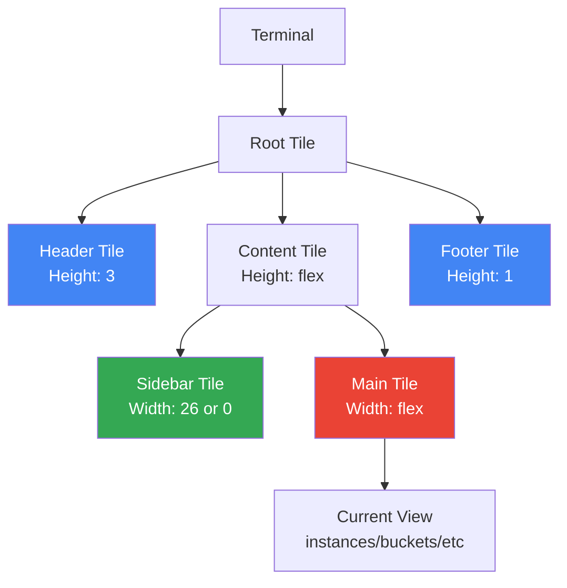

# Teatile Layout Implementation

## Summary of Changes

This implementation introduces a tile-based layout system using the [Teatile](https://github.com/bevicted/teatile) library to fix rendering glitches where the header would disappear when content was too long.

### Problem Statement

The application was experiencing visual glitches when:
- VM list had multiple pages (pagination)
- VM details page content was too long
- The header "gcon" would disappear

### Root Cause

The root cause was a mismatch between sidebar and content heights when using `lipgloss.JoinHorizontal()`. The existing manual height tracking was error-prone and didn't properly handle content overflow.

Additionally, `lipgloss.Height()` only pads short content but does NOT truncate long content. This meant that content exceeding its allocated space would overflow and break the layout.

## Solution

### 1. Teatile Layout Manager

Created a new layout package (`internal/ui/layout/layout.go`) that uses Teatile's tile hierarchy for automatic dimension calculation:

```
Root Tile (full terminal size)
├── Header Tile (fixed: 3 lines)
├── Content Tile (flex: remaining height)
│   ├── Sidebar Tile (fixed width when active)
│   └── Main Tile (flex: remaining width)
└── Footer Tile (fixed: 1 line)
```

### 2. Height Enforcement with MaxHeight

The key fix was using both `Height()` and `MaxHeight()` together in the `View()` method:

```go
contentStyle := lipgloss.NewStyle().
    Width(a.width).
    Height(contentHeight).
    MaxHeight(contentHeight)  // Truncates content that exceeds height
```

- `Height()` pads short content to fill the allocated space
- `MaxHeight()` truncates long content that exceeds the allocated space

### 3. Composition-Level Constraints

Height constraints are applied at the composition level (in `app.go`'s `View()` method), not in individual views. This:
- Allows views to render freely
- Ensures the final output always matches the terminal dimensions
- Simplifies view code by removing manual height calculations

## Files Changed

- `go.mod` - Added Teatile dependency
- `internal/ui/layout/layout.go` - New layout manager
- `internal/ui/layout/layout_test.go` - Layout tests
- `internal/ui/app.go` - Updated to use layout manager and MaxHeight
- `internal/ui/app_render_test.go` - Updated tests for new architecture

## Technical Details

### Teatile API

- `teatile.New()` - Creates a root tile
- `tile.NewSubtile()` - Creates a child tile
- `tile.WithSize(w, h)` - Sets dimensions (0 = auto-fill)
- `teatile.JoinVertical/JoinHorizontal()` - Arranges tiles
- `tile.GetSize()` - Returns calculated dimensions
- `tile.Recalculate()` - Recalculates after dimension changes

### lipgloss Height Behavior

```go
// Height only pads, doesn't truncate
style := lipgloss.NewStyle().Height(10)
result := style.Render(longContent)  // Still has all lines if > 10

// MaxHeight truncates
style := lipgloss.NewStyle().Height(10).MaxHeight(10)
result := style.Render(longContent)  // Exactly 10 lines
```

## Testing

All tests pass:
- Layout dimension tests verify correct height/width calculations
- Render height tests verify consistent terminal output
- Full test suite confirms no regressions

## Architecture Diagram


