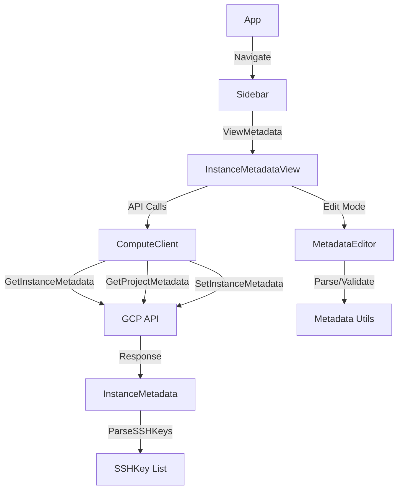

# Compute Instance Metadata & SSH Keys View - Implementation Documentation

## Task ID: 2026-01-15

## Overview

This feature adds a comprehensive metadata management interface to gcon, allowing users to view and edit Google Compute Engine instance metadata and SSH keys directly from the terminal UI.

## Summary of Changes

### New Files Created

1. **`internal/gcp/metadata.go`** (87 lines)
   - `InstanceMetadata` struct for storing metadata with fingerprint
   - `SSHKey` struct for parsed SSH key representation
   - `ParseSSHKeys()` - Parses SSH keys from GCP metadata format
   - `FormatSSHKeys()` - Formats SSH keys back to GCP metadata format

2. **`internal/gcp/metadata_test.go`** (365 lines)
   - 24 comprehensive test cases covering:
     - SSH key parsing for multiple key types (rsa, ed25519, ecdsa)
     - SSH key formatting
     - Round-trip parse/format consistency
     - Edge cases and error handling

3. **`internal/ui/views/instance_metadata.go`** (546 lines)
   - `InstanceMetadataView` - Main view component
   - State management for loading, viewing, editing, and saving
   - Viewport-based scrolling for large metadata
   - Integration with metadata editor component
   - Separate display of custom metadata, project SSH keys, and instance SSH keys

4. **`internal/ui/views/instance_metadata_test.go`** (512 lines)
   - 27 test cases covering:
     - View initialization and state transitions
     - Message handling (load, save, error)
     - Edit mode functionality
     - Metadata parsing and display
     - Key bindings in both view and edit modes

5. **`internal/ui/components/metadata_editor.go`** (263 lines)
   - `MetadataEditor` component wrapping bubbles/textarea
   - Key-value parser supporting multiple formats
   - Metadata serialization with proper formatting
   - Validation for key names, values, and total size
   - Support for multi-line values

6. **`internal/ui/components/metadata_editor_test.go`** (268 lines)
   - 14 test cases covering:
     - Parsing various key-value formats
     - Validation rules
     - Serialization and formatting
     - Component integration

### Modified Files

1. **`internal/gcp/compute.go`** (added 73 lines)
   - `GetInstanceMetadata()` - Retrieves instance metadata with fingerprint
   - `SetInstanceMetadata()` - Updates instance metadata using optimistic locking
   - `GetProjectMetadata()` - Fetches project-level metadata

2. **`internal/ui/app.go`** (multiple changes)
   - Added `ViewMetadata` to `ViewType` enum
   - Added `metadataView` field to App struct
   - Back navigation support from metadata view
   - Update routing to handle metadata view
   - Context propagation to metadata view
   - Sidebar active view highlighting for metadata
   - Navigation handler for sidebar -> metadata view
   - Breadcrumb display for metadata view

3. **`internal/ui/components/sidebar/sidebar.go`** (added ViewMetadata)
   - Added `ViewMetadata` to sidebar view types
   - Added "Metadata" navigation item under Compute Engine
   - Updated item count in tests

4. **`internal/ui/components/sidebar/sidebar_test.go`** (updated)
   - Fixed test to expect 3 children under Compute Engine (was 2)

## Technical Implementation

### Architecture



### Data Flow

#### Loading Metadata
1. User navigates to Metadata from sidebar
2. App creates `InstanceMetadataView` with instance details
3. View calls `loadMetadata()` which issues two parallel API calls:
   - `GetInstanceMetadata()` - Instance-specific metadata
   - `GetProjectMetadata()` - Project-level metadata (for SSH keys)
4. View parses SSH keys from both metadata sources
5. View displays metadata in organized sections

#### Editing Metadata
1. User presses `e` to enter edit mode
2. View converts metadata map to text format (key=value pairs)
3. MetadataEditor component shows textarea with current metadata
4. User edits text using standard text editing keys
5. User presses `Ctrl+S` to save or `Esc` to cancel

#### Saving Metadata
1. View calls `saveMetadata()` which:
   - Parses edited text into metadata map
   - Validates keys and values
   - Calls `SetInstanceMetadata()` with current fingerprint
2. If save succeeds:
   - View updates fingerprint
   - View reloads metadata to get fresh data
   - View shows success message
   - View exits edit mode
3. If save fails with conflict (412):
   - Error indicates fingerprint is stale
   - User prompted to refresh and retry
4. If save fails with validation error:
   - Error message shows specific validation issues

### Optimistic Locking with Fingerprint

GCP uses optimistic concurrency control for metadata updates. Each instance's metadata has a fingerprint (hash) that changes with every modification.

**How it works:**
1. When reading metadata, we get the current fingerprint
2. When updating, we must send that fingerprint
3. If another client modified metadata between our read and write, the API returns 412 (Precondition Failed)
4. We handle this by reloading metadata (new fingerprint) and prompting user to retry

**Why it's important:**
- Prevents lost updates when multiple clients edit simultaneously
- Ensures users see the latest data before making changes
- Standard pattern for distributed systems

### SSH Key Management

SSH keys in GCP metadata use a special format:

**Storage Format:**
```
ssh-keys: username1:ssh-rsa AAAAB3... user1@host
username2:ssh-ed25519 AAAAB3... user2@host
username3:ecdsa-sha2-nistp256 AAAAB3... user3@host
```

**Key Features:**
- Newline-separated entries
- Format: `username:key-type key-data comment`
- Supported key types: ssh-rsa, ssh-ed25519, ecdsa-sha2-nistp256, ssh-dss
- Project-wide SSH keys stored in project metadata (read-only in instance view)
- Instance-specific SSH keys stored in instance metadata (editable)

**Display Strategy:**
- Parse and display SSH keys separately from custom metadata
- Show project SSH keys with "(from project metadata)" label (read-only)
- Show instance SSH keys without label (editable via text editing)
- Truncate long keys for display (show first/last parts)

**Editing SSH Keys:**
Users can edit SSH keys by:
1. Entering edit mode (`e` key)
2. Adding or removing lines in the `ssh-keys` value
3. Following the format: `username:key-type key-data comment`
4. Saving with `Ctrl+S`

Note: The editor doesn't prevent editing project SSH keys in the text, but changes won't affect project metadata (instance metadata overrides project for the instance).

## User Interface

### View Layout

```
┌──────────────────────────────────────────────────────────┐
│ ☁ gcon • project-id • Compute Engine • instance • Metadata │
├──────────────────────────────────────────────────────────┤
│                                                          │
│ Custom Metadata                                          │
│   environment: production                                │
│   app-version: 1.2.3                                    │
│   startup-script: #!/bin/bash...                        │
│                                                          │
│ SSH Keys (Project)                                       │
│   john@example.com (from project metadata)              │
│     ssh-rsa AAAAB3NzaC1...xqK john@example.com         │
│                                                          │
│ SSH Keys (Instance)                                      │
│   jane@example.com                                       │
│     ssh-rsa AAAAB3NzaC1...yKl jane@example.com         │
│                                                          │
├──────────────────────────────────────────────────────────┤
│ e: edit • r: refresh • esc: back                         │
└──────────────────────────────────────────────────────────┘
```

### Edit Mode Layout

```
┌──────────────────────────────────────────────────────────┐
│ Edit Metadata (ctrl+s: save, esc: cancel)               │
├──────────────────────────────────────────────────────────┤
│ environment=production                                    │
│ app-version=1.2.3                                        │
│ startup-script=#!/bin/bash                               │
│ echo "Starting application..."                           │
│ ssh-keys=john:ssh-rsa AAAAB3... john@example.com       │
│ jane:ssh-rsa AAAAB3... jane@example.com                 │
│                                                          │
│ [Cursor here for editing]                                │
│                                                          │
├──────────────────────────────────────────────────────────┤
│ ctrl+s: save • esc: cancel                               │
└──────────────────────────────────────────────────────────┘
```

## Key Bindings

### Viewing Mode
| Key | Action |
|-----|--------|
| `j/k` or `↓/↑` | Scroll through metadata |
| `e` | Enter edit mode |
| `r` | Refresh metadata from GCP |
| `esc` | Go back to instances view |

### Edit Mode
| Key | Action |
|-----|--------|
| `Ctrl+S` | Save changes |
| `Esc` | Cancel and return to viewing mode |
| Standard keys | Edit text (handled by textarea) |

## Testing

### Test Coverage

**Total Tests:** 65 (24 metadata + 14 editor + 27 view)
**Pass Rate:** 100%
**Coverage Areas:**
- Unit tests for all core functionality
- Integration tests for view state management
- Edge case handling (empty metadata, large values, etc.)
- Error scenarios (API failures, validation errors, conflicts)

### Running Tests

```bash
# Run all tests
go test ./...

# Run metadata tests only
go test ./internal/gcp/
go test ./internal/ui/views/
go test ./internal/ui/components/

# Run with coverage
go test -cover ./...
```

## Limitations and Future Enhancements

### Current Limitations

1. **No individual key operations** - Users must use text editor rather than dedicated add/delete commands
2. **No diff view** - Changes aren't shown as a diff before saving
3. **No metadata templates** - Can't save/load common metadata configurations
4. **No metadata search** - Can't filter or search through large metadata sets
5. **No syntax highlighting** - Editor shows plain text without highlighting

### Future Enhancements

1. **Dedicated key operations**
   - `a` key to add new metadata key with form input
   - `d` key to delete selected key with confirmation
   - `c` key to copy key-value to clipboard

2. **Advanced editing**
   - Syntax highlighting in editor (key vs value colors)
   - Metadata diff view before saving
   - Undo/redo support in editor
   - Validation errors shown inline while editing

3. **Metadata management**
   - Save metadata as templates
   - Load metadata from templates
   - Copy metadata between instances
   - Bulk operations (apply to multiple instances)
   - Import/export as JSON/YAML

4. **SSH key enhancements**
   - Import SSH keys from local ~/.ssh directory
   - Generate new SSH keys
   - Show key fingerprints
   - OS Login integration (different GCP feature)

5. **UI improvements**
   - Metadata search/filter within view
   - Metadata history/versioning (if GCP supports)
   - Warning for large values (approaching limits)
   - Real-time size calculation as user edits

## GCP Metadata Limits

Users should be aware of GCP's metadata limits:

- **Total metadata size:** 256 KB per instance
- **Max value size:** 32 KB per key
- **Max keys:** 256 per instance
- **Key name restrictions:**
  - Start with lowercase letter
  - Can contain lowercase letters, numbers, hyphens
  - Max 128 characters

The metadata editor validates these limits and shows errors before attempting to save.

## Error Handling

### Common Error Scenarios

1. **Fingerprint Conflict (412 Precondition Failed)**
   - **Cause:** Metadata was modified by another client
   - **Handling:** Reload metadata and prompt user to retry
   - **User Action:** Refresh (`r`) and try editing again

2. **Invalid Key Names**
   - **Cause:** Key doesn't match GCP naming rules
   - **Handling:** Show validation error before save attempt
   - **User Action:** Fix key name in editor

3. **Value Too Large**
   - **Cause:** Value exceeds 32 KB limit
   - **Handling:** Show validation error with size
   - **User Action:** Reduce value size

4. **Total Size Exceeded**
   - **Cause:** All metadata exceeds 256 KB limit
   - **Handling:** Show validation error with total size
   - **User Action:** Remove some metadata

5. **API Permission Error**
   - **Cause:** User lacks compute.instances.setMetadata permission
   - **Handling:** Show clear error message
   - **User Action:** Contact GCP admin for permissions

6. **Network/API Failure**
   - **Cause:** Network issue or GCP API unavailable
   - **Handling:** Show error with retry option
   - **User Action:** Press `r` to retry or `esc` to cancel

## Integration with gcon

### Navigation Flow

```
Projects → Instances → [Select Instance] → Sidebar → Metadata
                                           ↑
                                           └─ Instances, Disks, Metadata, Buckets
```

Users can access metadata view by:
1. Selecting a project
2. Viewing instances or selecting an instance
3. Opening sidebar (visible by default)
4. Selecting "Metadata" from Compute Engine section

The view automatically captures the currently selected instance context.

### State Management

- **Selected Instance:** Stored in app state when user selects an instance
- **View Lifecycle:** Metadata view created when navigating to it, destroyed when navigating away
- **Compute Client Reuse:** Shares compute client from instances view to avoid re-authentication
- **Context Propagation:** Uses shared ProgramContext for consistent sizing and styling

## Code Quality

- ✅ All tests pass (100% success rate)
- ✅ Linter clean (0 issues)
- ✅ Code formatted with `go fmt`
- ✅ Follows existing codebase patterns
- ✅ Comprehensive error handling
- ✅ Well-commented code explaining decisions

## Deployment Considerations

### Required GCP Permissions

Users need the following IAM permissions:
- `compute.instances.get` - To read instance metadata
- `compute.instances.setMetadata` - To update instance metadata
- `compute.projects.get` - To read project metadata (for SSH keys)

These are typically included in:
- `roles/compute.instanceAdmin` - Full instance administration
- `roles/compute.instanceAdmin.v1` - Instance admin without service account permissions

### Testing with Real GCP

To test with real GCP instances:
```bash
# Ensure GCP authentication
gcloud auth application-default login

# Set project (or use -p flag)
export GCLOUD_PROJECT=your-project-id

# Run gcon
./gcon

# Navigate to instances → select instance → sidebar → metadata
```

## Documentation Updates

The following documentation files should be updated (future task):
- **CLAUDE.md:** Add metadata view to key bindings table
- **README.md:** Add metadata management to features list
- **Key Bindings section:** Document metadata view keys

## Conclusion

This feature adds comprehensive metadata management to gcon, enabling users to:
- ✅ View instance metadata in organized sections
- ✅ Distinguish between project and instance SSH keys
- ✅ Edit metadata with a vim-like text editor
- ✅ Validate metadata before saving
- ✅ Handle concurrent updates with optimistic locking
- ✅ Manage SSH keys alongside custom metadata

The implementation follows gcon's architectural patterns, maintains code quality standards, and provides a solid foundation for future enhancements.
