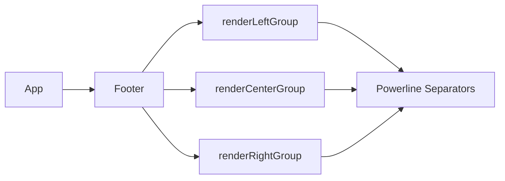

# Footer Component with Multi-Section Layout

## Summary

Added a new Footer component with powerline-style separators and colored sections, replacing the previous simple footer implementation.

## Changes Made

### New Files
- `internal/ui/components/footer.go` - New Footer component with fixed slots
- `internal/ui/components/footer_test.go` - Unit tests for Footer component

### Modified Files
- `internal/ui/app.go` - Integrated new Footer component, replaced `renderFooter()`

## Footer Structure

```
[Left1][Left2][Left3]    [Center1|Center2|Center3]    [Right1][Right2][Right3]
   └─────────────────┴──────────────────────────────────┴────────────────────┘
         Powerline separators with colored backgrounds
```

### Slot Assignments
| Slot | Content | Background |
|------|---------|------------|
| Left1 | Navigation (`esc back`/`esc quit`) | Blue (#4285F4) |
| Left2 | Mode indicator (`[ sidebar`) | Light blue (#5A95F5) |
| Left3 | Shortcuts (`: cmd • ? help`) | Dark (#303134) |
| Center1-3 | View-specific info | Dark |
| Right1 | Project ID | Dark |
| Right2 | Task status | Custom (via pre-rendered) |

## API

```go
// Create footer
f := components.NewFooter()

// Set width (required before rendering)
f.SetWidth(terminalWidth)

// Set slots
f.SetLeft1("esc back")
f.SetLeft2("[ sidebar")
f.SetLeft3(": cmd • ? help")
f.SetRight1("my-project")

// Pre-rendered content for task status (with custom colors)
f.SetRight2Styled(taskRunningStyle.Render("⠋ Loading..."))

// Clear slots
f.ClearLeft1()
f.ClearCenter()

// Render
view := f.View()
```

## Powerline Separators

Uses Unicode Private Use Area characters for powerline fonts:
- `\ue0b0` - Right arrow (solid)
- `\ue0b1` - Right arrow (thin)
- `\ue0b2` - Left arrow (solid)
- `\ue0b3` - Left arrow (thin)

**Note**: Requires a terminal font with powerline symbol support (e.g., Nerd Fonts, Powerline fonts).

## Architecture



The Footer component:
1. Receives slot content via setter methods
2. Groups slots into left/center/right groups
3. Renders each group with powerline separators
4. Calculates spacing to fill the terminal width
5. Returns a single-line string

## Testing

Run tests:
```bash
go test -v ./internal/ui/components/...
```

Key test cases:
- Slot setting/clearing
- Width handling
- Powerline separator rendering
- Pre-rendered styled content
- Single-line output verification
