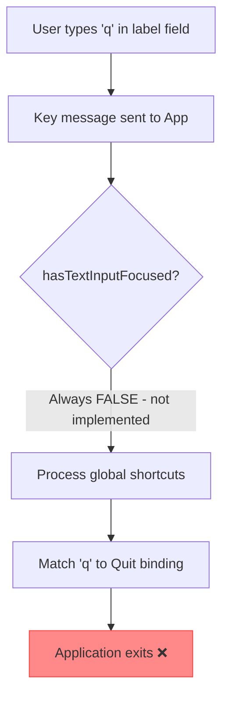
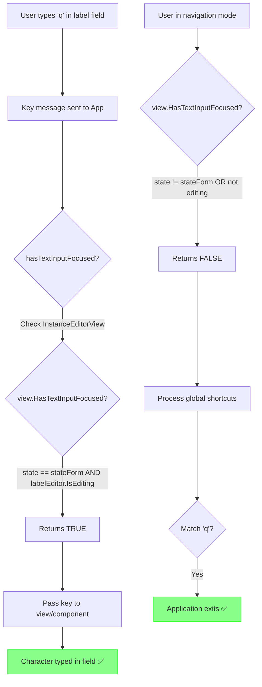
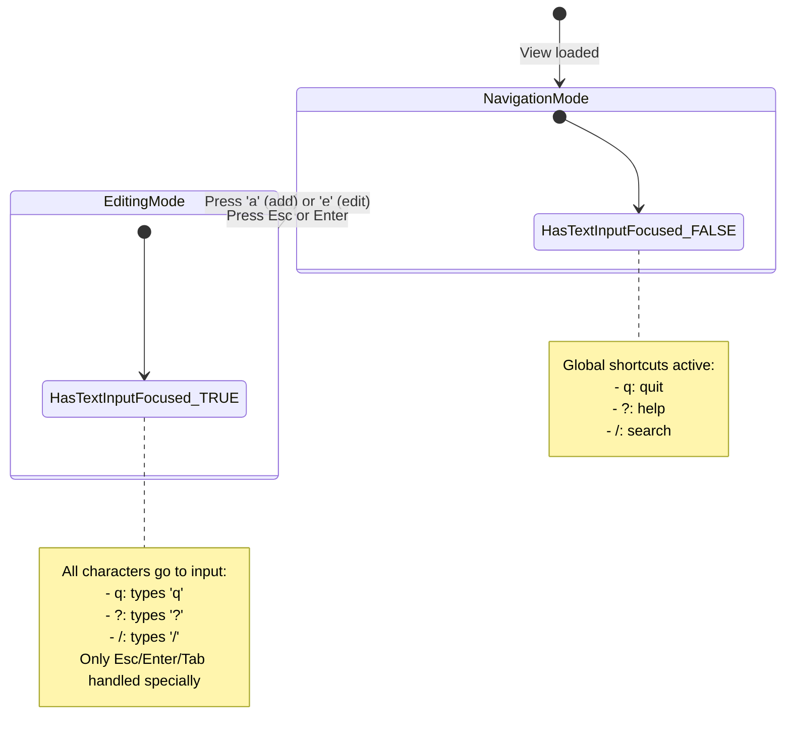
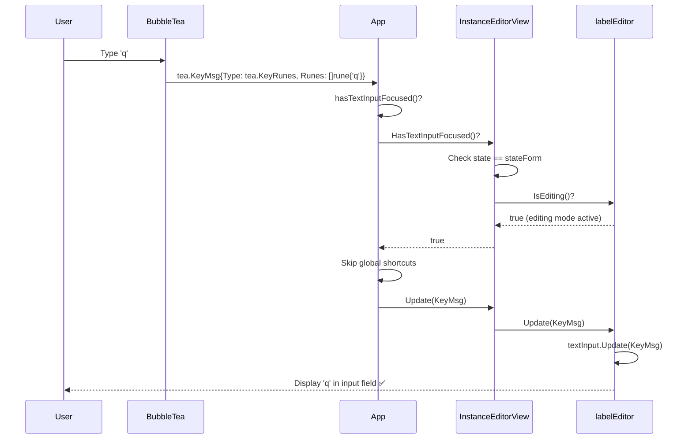
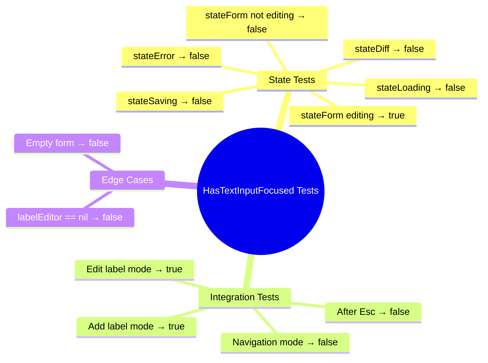

# Label Editor Key Handling Flow

## Before Fix (Bug)



## After Fix (Working)



## State Transitions



## Implementation Details

### InstanceEditorView.HasTextInputFocused()

```go
func (v *InstanceEditorView) HasTextInputFocused() bool {
    // ┌─────────────────────────────────────────┐
    // │ Check 1: Must be in form state         │
    // │ (not loading, saving, or showing diff) │
    // └─────────────────────────────────────────┘
    if v.state == stateForm && v.labelEditor != nil {
        // ┌───────────────────────────────────────────┐
        // │ Check 2: Label editor must be editing    │
        // │ (user pressed 'a' or 'e', inputs active) │
        // └───────────────────────────────────────────┘
        return v.labelEditor.IsEditing()
    }
    return false
}
```

### labelEditor.IsEditing()

```go
func (e *Editor) IsEditing() bool {
    return e.editing || e.adding
    //     ^^^^^^^^^^    ^^^^^^^^^
    //     User pressed  User pressed
    //     'e' to edit   'a' to add
}
```

## Key Message Flow in App



## Test Coverage


