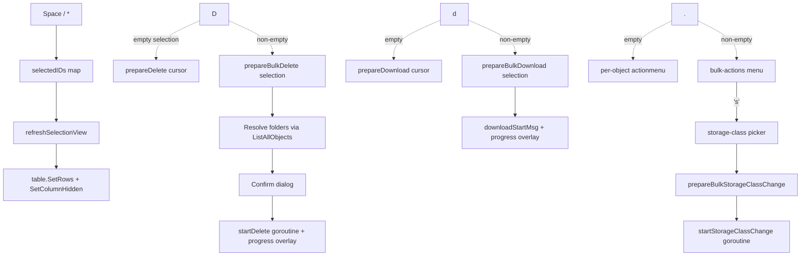

# Bulk Actions in Cloud Storage Objects Browser — Implementation Notes

## Summary

Adds multi-select to the Cloud Storage Objects browser and three bulk
operations on the selection: **delete**, **download**, and **change
storage class**. The same single-row keys (`D`, `d`, action menu `.`)
now route to the selection when it's non-empty and to the cursor row
otherwise — no new shortcuts to memorize.

## UX

| Gesture | Action |
|---------|--------|
| `Space` | Toggle bulk-select on cursor row (never the `..` row) |
| `*` | Select-all on currently visible (post-filter) rows; toggle off when all already selected |
| `D` | Bulk delete when selection ≠ ∅, else cursor row |
| `d` | Bulk download when selection ≠ ∅, else cursor row |
| `.` | Bulk-actions menu when selection ≠ ∅ (Download / Delete / Change storage class) |
| `Esc` | Clear selection first; if empty, navigate back |

- A `Sel` column appears at the leftmost position the moment the first
  row is selected; it hides again when the selection is cleared.
- Status bar shows `[N selected]` next to the existing scroll hint.
- Folder navigation (`enter` on folder, `→`, `←`, `..`, `r`,
  post-upload/post-delete reload) clears the selection. Cursor
  movement (`j`/`k`/arrows) preserves it so the user can build a
  selection while scrolling.

## Architecture

## Files changed

| File | Purpose |
|------|---------|
| `internal/gcp/storage.go` | New `UpdateObjectStorageClass` — server-side rewrite to self via `Object.CopierFrom(...).Run` with `Copier.StorageClass`. GCS does not expose StorageClass as a metadata-only update. |
| `internal/ui/components/table/table.go` | Adds `VisibleRows()` (filtered view), `SetCursor()`, `visibleCells()` helper that drops hidden-column cells, and an `underlyingColIndex()` mapper used by sort/filter to index `row.Data` correctly when hidden columns are present. `SetColumnHidden` now safely rebuilds the bubbles column+row state across both growth and shrink directions, preserves the cursor across the rebuild, and works pre-`SetSize`. |
| `internal/ui/components/table/table_test.go` | New regression tests: `SetColumnHidden_PropagatesBeforeSetSize`, `_DoesNotPanicOnRender`, `_PreservesCursor`, `SetRows_ShapesCellsToVisibleColumns`, `ParseFilter_HiddenColumnDoesNotMisalignFieldIndex`, `SortRows_RespectsHiddenColumnOffset`, `VisibleRows_ReflectsActiveFilter`. |
| `internal/ui/views/objects.go` | Selection state, Space/* handlers, bulk-action menu + storage-class picker, `prepareBulkDelete` / `prepareBulkDownload` / `prepareBulkStorageClassChange` resolvers (with folder expansion + dedup), `startStorageClassChange` goroutine + progress overlay. Switched all five overlay helpers (action menu, delete confirm, download/upload/delete/storage-class progress) to `overlay.Center` so the popup doesn't blank surrounding table cells. Switched completion sends in delete/download/upload/storage-class goroutines to **blocking** so a full channel buffer can't drop the `done` signal and hang the UI. |
| `internal/ui/views/objects_test.go` | Selection toggle, select-all (with `..` exclusion), navigation-clears-selection, bulk-menu open, error clearing. |
| `README.md`, `.claude/rules/key-bindings.md` | Documented `Space`, `*`, bulk routing of `D`/`d`/`.`. |
| `CLAUDE.md` | Bulk actions added to the Implemented Features list. |

## Notable correctness fixes (shared infrastructure)

These all sat behind the new hidden-column functionality and were caught
during review:

- **`parseFilter` / `matchesFilterSpec`** stored visible-column indices
  but `row.Data` is indexed by underlying colDef position. With a hidden
  column before the target, `name:foo` would read the wrong cell. Fixed
  to use underlying indices.
- **`sortRows`** same issue — switched to `underlyingColIndex` translation.
- **`SetColumnHidden` panic**: bubbles' `renderRow` iterates row cells
  and indexes columns. Shrinking columns before re-shaping rows panics;
  shrinking rows first panics the opposite direction. Fixed by clearing
  bubbles' rows (`SetRows(nil)`), then recalc, then re-emit reshaped
  rows — the empty intermediate state is safe in either direction.
- **Overlay popups blanked surrounding content**: the old `lines[row] =
  spaces + popupLine` pattern replaced full rows with the popup line.
  Switched to `overlay.Center` which preserves left/right portions of
  each affected row.
- **Completion sends in goroutines were non-blocking**: a full channel
  buffer could drop the `done` signal, hanging `waitForProgress`-style
  tea commands forever. Fixed for delete, download, upload, and
  storage-class change.
- **`recalcColumns` was a no-op until `SetSize`** — `SetColumnHidden`
  called at construction time updated colDefs but left bubbles' column
  set out of date until the first resize.
- **Stale errors after navigation**: `navigateUp`/`navigateInto`
  didn't clear `v.err`, so `View()` could short-circuit on an old
  error after a successful new load. Centralized in `beginNavigation`.

## Out of scope (deferred)

- **Copy / move to another folder** — needs a destination-folder picker
  dialog. Worth a separate PR.
- **Bulk hold toggles, custom-time updates, content-type fixes** —
  user said "skip unless asked".

## Testing

- 14 new unit tests in the views and table packages.
- Lint clean (`golangci-lint 2.12.2`).
- Full test suite green on Go 1.26.3.
