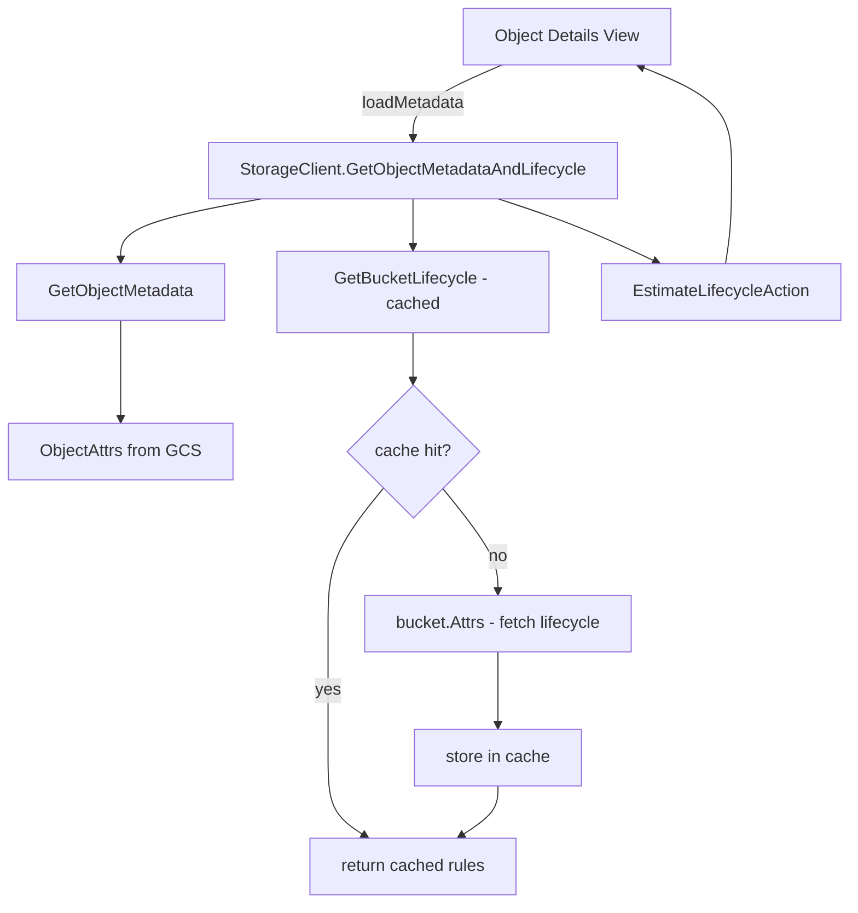

# Object Lifecycle & TTL — Implementation Notes

## Summary

The Object Details view (Cloud Storage → bucket → object → `i`) now shows a
**Lifecycle & Retention** section that surfaces:

- **Estimated next lifecycle action** computed from the bucket's lifecycle
  rules (e.g. *Delete in 12 days* or *Set storage class → COLDLINE*).
- **Per-object retention** (mode + retain-until) when configured.
- **Bucket retention expiration** when the bucket policy applies.
- **Holds** — Event-based and Temporary holds, which block deletion outright.
- **Custom time** — when set, used by lifecycle conditions.

Two new informational rows were added to **Technical Details**:

- **Components** — number of source objects for composite uploads.
- **KMS Key** — CMEK key path when CMEK encryption is in use.

GCS does not have a per-object TTL field; expiration is the result of bucket
lifecycle rules combined with object age, custom time, prefix/suffix, and
storage class. The estimator walks all rules, finds the matches that apply
to a specific object, and reports the soonest one.

## Architecture

## Files changed

| File | Purpose |
|------|---------|
| `internal/gcp/storage.go` | Added retention/hold/lifecycle fields to `ObjectMetadata`; added `LifecycleAction`/`LifecycleCondition`/`LifecycleRule`/`EstimatedLifecycleAction` types; added `lifecycleCache` (sync.Map) and injectable `now` clock to `StorageClient`. |
| `internal/gcp/storage_lifecycle.go` (new) | `GetBucketLifecycle` with 5-minute TTL cache, `InvalidateBucketLifecycle`, `EstimateLifecycleAction` (pure matcher), `GetObjectMetadataAndLifecycle` convenience. |
| `internal/gcp/storage_lifecycle_test.go` (new) | Table-driven tests for the estimator across condition types and selection ordering; cache TTL test using injected clock. |
| `internal/ui/views/object_details.go` | Added `lifecycleEstimate` field; switched `loadMetadata` to use combined fetcher; rendered Lifecycle & Retention section; added KMS/Components rows in Technical Details; added `formatLifecycleAction` / `formatLifecycleEffective` / `hasLifecycleInfo` helpers. |
| `internal/ui/views/object_details_test.go` (new) | Render tests confirming the section appears for estimates and holds and stays hidden when there's nothing to show. |

## Caching strategy

Bucket lifecycle rules are cached on the `StorageClient` itself (not per
view), keyed by bucket name, with a **5-minute TTL**. This means:

- Opening many objects in the same bucket → 1 lifecycle fetch (bucket attrs)
  total.
- The cache survives navigation between views during a session.
- Admin-side lifecycle changes show up within 5 minutes without a restart.
- Failures are non-fatal: if `GetBucketLifecycle` errors (most often
  insufficient `storage.buckets.get` permission), the object metadata is
  still returned and the section just hides the estimate row.

If a future feature edits lifecycle rules, it should call
`StorageClient.InvalidateBucketLifecycle(bucketName)` after a successful
patch so the next read sees fresh data.

## Estimator behavior

`EstimateLifecycleAction(rules, meta, now)` is a pure function with no GCP
client dependency, which makes it cheap to test exhaustively. It:

1. Filters out rules whose storage-class / prefix / suffix / liveness
   filters disqualify the object.
2. Computes the *latest* of any specified time-based conditions
   (`AgeInDays`, `DaysSinceCustomTime`) — all conditions must hold, so the
   action is effective at the latest of them.
3. Verifies hard predicates (`CreatedBefore`, `CustomTimeBefore`).
4. Skips rules requiring data we don't fetch (`NumNewerVersions`,
   `Liveness=archived`).
5. Picks the **earliest** matching candidate across all rules.
6. Returns a zero `EffectiveAt` for actions that are already due.

Holds (`EventBasedHold`, `TemporaryHold`) and per-object retention
(`Retention.Mode` + `RetainUntil`) are **not** factored into the estimate —
they block deletion at the GCS layer regardless of lifecycle rules. The UI
shows them as separate rows so users can see both signals.

## Testing

- **Unit**: 10 tests in `storage_lifecycle_test.go` covering age, custom
  time, prefix/suffix, storage class filter, multi-rule earliest-wins,
  immediate (already-past) trigger, archived-liveness skip, no-match, and
  cache TTL.
- **Render**: 5 tests in `object_details_test.go` covering presence of the
  section under different signals, omission when nothing applies, and
  helper formatting.
- **Lint**: passes with zero issues.

## Out of scope (potential follow-ups)

- Editing lifecycle rules (currently read-only).
- Editing per-object retention (currently read-only).
- Soft-deleted object listing.
- A "Lifecycle" tab on the Bucket Details view that shows all rules.
